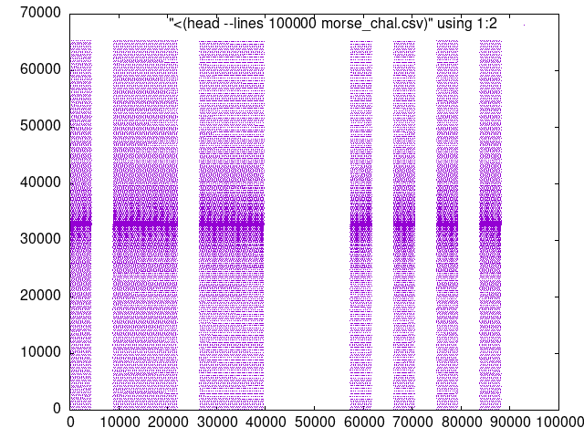

# Morse Code

You _could_ just inspect the given file with e.g. Audacity and manually read
off the more code and decoded them, but that's no fun.

To start with, we can inspect the data we have by graphing it, firstly we
convert the `.wav` file to a `.csv` via `./generate_csv.py`, then plot the data
using GNU plot (see `./plot.gnu`). Writing to a PNG image via:

``` 
$ gnuplot -e 'set terminal png' plot.gnu > plot.png
```

Which gives us:



Using this we can write a script to read off the _dits_ and _dahs_ and decode
the morse code (see `./solution.py`)
